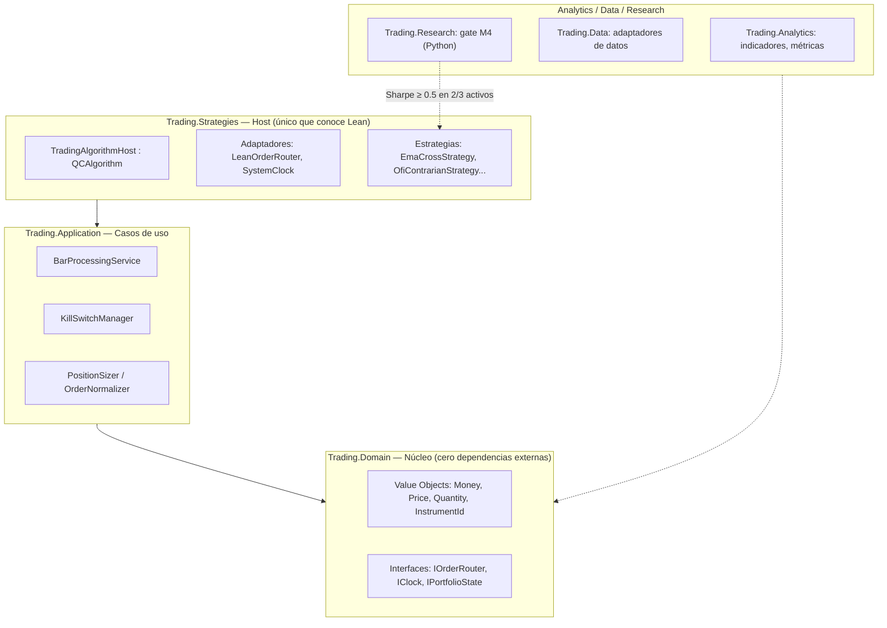

# Sistema de Trading Algorítmico Institucional

Sistema propio de research, backtesting y ejecución en vivo de estrategias sistemáticas en cripto, construido sobre el motor open-source [QuantConnect/Lean](https://github.com/QuantConnect/Lean) con una capa de dominio propia bajo Clean Architecture / DDD.

No es un clon de Lean con algoritmos de ejemplo: es un sistema de decisión con arquitectura desacoplada del motor, un gate estadístico obligatorio antes de arriesgar una sola línea de implementación, y una bitácora de ~50 ADRs que documenta cada decisión — incluida cada estrategia que **se mató a propósito** por no sobrevivir la validación.

**Autor:** Benjamín Otero — [LinkedIn](https://www.linkedin.com/in/benjamin-otero/)

---

## Por qué existe este repo

Es mi proyecto personal de aprendizaje profundo en ingeniería de sistemas de trading: research cuantitativo, arquitectura de software de grado institucional y operación de un sistema vivo (paper trading con broker real, 24/7 en un VPS). Lo comparto porque estoy buscando oportunidades en **desarrollo de software para trading algorítmico / fintech**, y este código es la evidencia más honesta de cómo trabajo.

## Filosofía: rigor antes que resultados

La pregunta que gobierna cada decisión no es *"¿funciona esta estrategia?"* sino *"¿cómo sé que no me estoy mintiendo a mí mismo?"*. En la práctica, eso significa:

- **Ninguna estrategia llega a implementarse sin pasar antes un gate estadístico (M4)** sobre datos correctos, con costos reales incluidos.
- **Toda validación se corre in-sample / out-of-sample**, nunca se acepta un resultado solo-IS.
- **Cada hipótesis rechazada queda documentada** en [`Trading.Research/strategy_experiments.md`](Trading.Research/strategy_experiments.md) con la razón exacta del rechazo — no se borra el rastro de lo que no funcionó.
- **Cuando el propio pipeline de validación tuvo un bug** (un lookahead sutil de apareo de features que *inflaba* el Sharpe de 6.6 a un real −0.29), el hallazgo se documentó, se corrigió la causa raíz y se re-auditaron todas las estrategias que habían pasado bajo el bug — sin excepciones. Ver ADR-053/054.
- **Toda decisión arquitectónica queda en un ADR** ([`DECISIONS.md`](DECISIONS.md), ~50 entradas) — nada se decide "de pasada" en un commit.

El estado actual de investigación es deliberadamente honesto: tras más de una decena de ejes de hipótesis (microestructura, cross-sectional, régimen HMM, momentum, volatilidad, lead-lag) el research está en una fase de re-evaluación estructural — la mayoría fue **rechazada por costos reales o por no sobrevivir OOS**, no aprobada a la fuerza para tener "algo que mostrar". Ese es el punto: un sistema que no puede matar una mala idea no sirve para nada en producción.

## Arquitectura

Clean Architecture con una regla no negociable: **el dominio y la aplicación no conocen QuantConnect.**



| Capa | Responsabilidad | Regla de oro |
|---|---|---|
| `Trading.Domain` | Value objects, interfaces, excepciones de dominio | Cero dependencias externas; síncrono y determinista (sin `async`, sin I/O, sin reloj de sistema) |
| `Trading.Application` | Orquestación, risk management, sizing | Solo depende de `Trading.Domain`; interactúa con el exchange vía abstracciones inyectadas |
| `Trading.Strategies` | Host (`QCAlgorithm`), adaptadores, estrategias | Único proyecto que puede hacer `using QuantConnect;` |
| `Trading.Analytics` | Indicadores y cálculos analíticos | — |
| `Trading.Data` | Adaptadores de datos / repositorios | — |
| `Trading.Research` | Screening estadístico (M4, Python) antes de tocar C# | Gate obligatorio: si no pasa, no se implementa |

Otras reglas de ingeniería que se aplican sin excepción (documentadas en [`AI.md`](AI.md)): prohibido `double`/`float` en cualquier magnitud monetaria (siempre `decimal` + value objects `Money`/`Price`/`Quantity`), prohibido `DateTime.UtcNow` fuera de los adaptadores (todo acceso al tiempo vía `IClock`, inyectable y testeable), prohibido estado estático mutable en Domain/Application, cero abreviaturas en nombres de variables.

## Qué se validó en producción (no solo en backtest)

- **Paper trading en vivo 24/7** en un VPS, con ciclo completo de gestión de posición (entrada → stop/take-profit → cierre) validado end-to-end sobre BTCUSDT/ETHUSDT/SOLUSDT.
- **Integración con broker real (Binance)**: routing de órdenes real, resolución de bloqueos operativos de exchange en vivo (rate limits, sincronización de reloj con tolerancia de 1000ms, validación de notional mínimo).
- **Dead-man's switch y monitor de salud** (`StrategyHealthMonitor`) que apaga una estrategia automáticamente si degrada por debajo de umbrales operativos definidos en [`POLICY.md`](POLICY.md) — no un backtest bonito sin control de riesgo real.
- **Pipeline de features de microestructura en vivo** (order flow imbalance, CVD) calculado desde el stream de trades del exchange, no solo sobre datos históricos.

## Stack técnico

- **C# / .NET** — motor de ejecución y dominio (sobre QuantConnect Lean)
- **Python** — screening estadístico M4 (~38 scripts), Monte Carlo, modelos de régimen (HMM)
- **Binance** (spot/futures) — broker de datos y ejecución, real y paper
- **xUnit** — suite de tests (Domain, Application, Strategies)
- **VPS Windows** — despliegue live 24/7, con sincronización de reloj NTP dedicada para tolerancia de exchange

## Estructura del repositorio

Este repo es un fork de Lean; las carpetas propias del sistema de trading son:

```
Trading.Domain/         Entidades, interfaces, value objects
Trading.Application/    Casos de uso, risk management, sizing
Trading.Strategies/     Implementaciones IStrategy + host de QuantConnect
Trading.Analytics/      Indicadores y métricas
Trading.Data/           Adaptadores de datos
Trading.Research/       Screening M4 (Python) + bitácora de experimentos
Trading.Models/         Modelos de régimen entrenados (HMM)
*.Tests/                Suites de test por capa
```

El resto del árbol (`Algorithm.CSharp/`, `Engine/`, `Brokerages/`, etc.) es el motor Lean original — ver [`Documentation/LEAN-ENGINE.md`](Documentation/LEAN-ENGINE.md) para la documentación del engine base y cómo compilarlo/correrlo localmente.

## Documentos vivos del proyecto

| Documento | Contenido |
|---|---|
| [`ROADMAP.md`](ROADMAP.md) | Estado actual, hitos completados y en curso, deuda técnica |
| [`DECISIONS.md`](DECISIONS.md) | ~50 ADRs — el porqué de cada decisión arquitectónica |
| [`POLICY.md`](POLICY.md) | Reglas operativas en producción: umbrales de riesgo, runbooks |
| [`AI.md`](AI.md) | Estándar de arquitectura y convenciones de código |
| [`Trading.Research/strategy_experiments.md`](Trading.Research/strategy_experiments.md) | Bitácora de hipótesis probadas y por qué se rechazaron |

## Licencia

Este proyecto hereda la licencia Apache 2.0 del motor [QuantConnect/Lean](https://github.com/QuantConnect/Lean). Ver [`LICENSE`](LICENSE).
